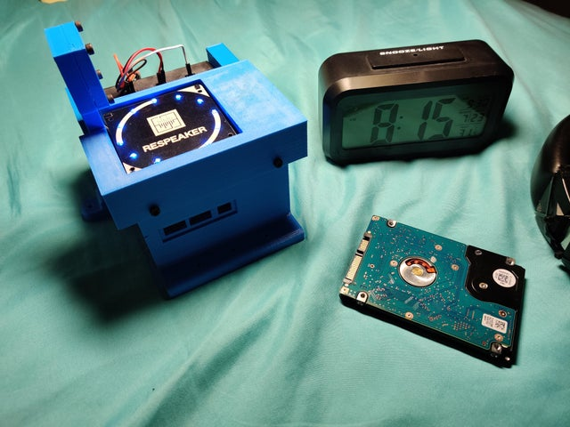
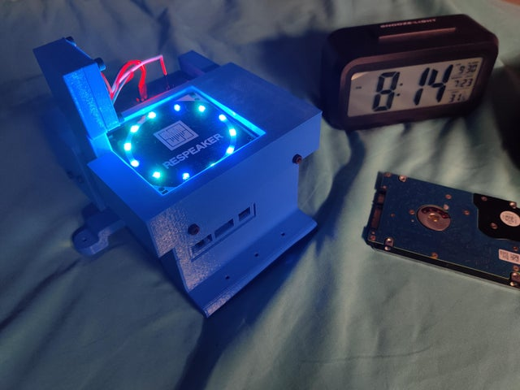
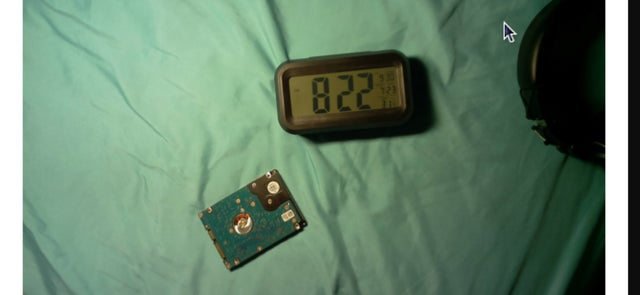

# **Raspberry-Pi-Computer-Vision**

## **Abstract**

*The Raspberry-Pi is has been meticulously assembled with the sourced
parts and 3d-Printed External Body Frame. It has an I/O Panel with
soldered LED's and a Button.*

# Installation


**Step 1:** Download my Raspbian Image: https://1drv.ms/u/s!Aj3B7or9ZmxnpnM3DD8MNpDMdQnO [It has the Firmware, Drivers and Virtual Environment for Python]

**Step 2:** **Flash SD-Card** using **balenaEtcher** **[with the Image in Step 1]**

**Step 3:** **Copy Scripts** from **(Scripts) -home-pi-Desktop-** to **/home/pi/Desktop** - https://github.com/MarcusThum/Raspberry-Pi-Computer-Vision/tree/main/(Scripts)%20-home-pi-Desktop-

**Step 4:** ``` cd Desktop/ ```

**Step 5:** Activate Virtual Environment for Python ``` . myenv/bin/activate ```

**Step 6:** ```bash recording_examples/get_device_index.py``` **Look for Device Index**

**Step 7:** ```nano recording_examples/record_one_channel.py``` **Edit RESPEAKER_INDEX = "CHANGE ID NUMBER"**

**Step 8**: Run ``` bash GPIO.py ```

**What is zip.py?** Run ```bash zip.py``` to Zip All Images and Audio [All Files are stored on Desktop]


# Design Files

**(3dPrintFile) Design Files** : https://github.com/MarcusThum/Raspberry-Pi-Computer-Vision/tree/main/(3dPrintFile)%20Design%20Files

> Extension Explanation: .STL Files are 3d Printable Files that can be sliced and printed by a 3d Printer. They are exported from a CAD Application.

**NOTE: My 3d Models has Low Tolerance for Assembly. It won't fit so easily. You Might Want to Design Your own Files. Use a CAD Application. CAD Stands for Computer Aided Designs**

# Technical Document

**Technical Document:** https://github.com/MarcusThum/Raspberry-Pi-Computer-Vision/blob/main/Technical-Document.pdf

# Components List (BOM Table):

**Components List:** https://github.com/MarcusThum/Raspberry-Pi-Computer-Vision/blob/main/Components-BOM.pdf


# Pictures
## Body

## Microphone

## Camera Sample Image



# Linked From REDDIT:
Final Product: https://www.reddit.com/r/3Dprinting/comments/oq1q45/update_completed_rpispy_visionmicarray/

Initial Assembly [Without Setup & Code]: https://www.reddit.com/r/3Dprinting/comments/nu26k6/raspberry_pi_computer_vision_setup/?utm_medium=android_app&utm_source=share
