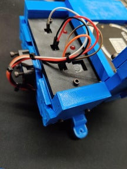
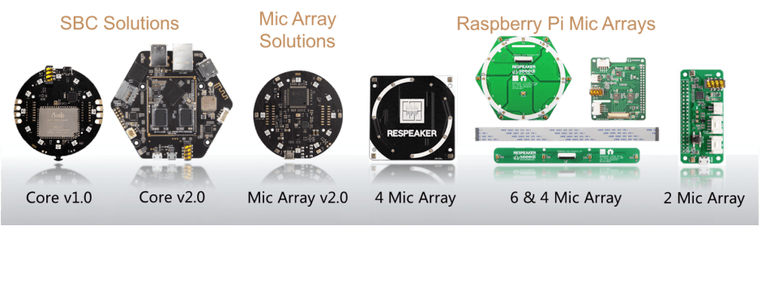
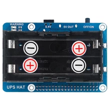
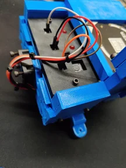
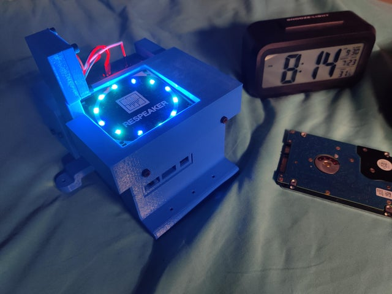
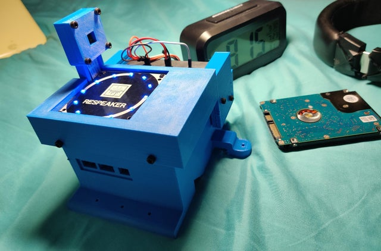
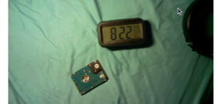
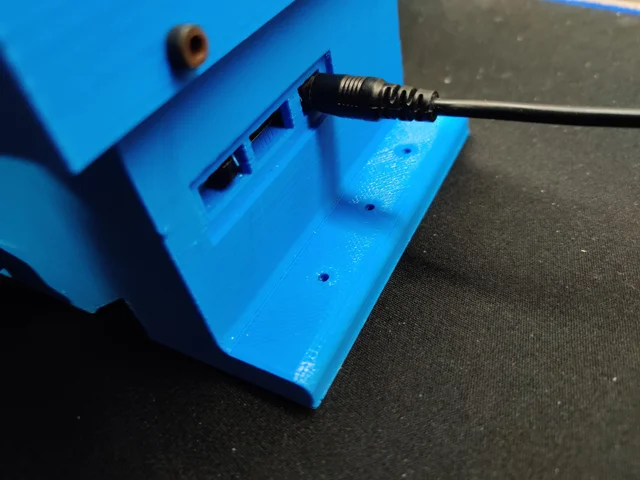

# **Raspberry-Pi-Computer-Vision**

## **Abstract**

*The Raspberry-Pi is has been meticulously assembled with the sourced
parts and 3d-Printed External Body Frame. It has an I/O Panel with
soldered LED's and a Button.*

# Installation

```
Step 1: Download my Raspbian Image: https://1drv.ms/u/s!Aj3B7or9ZmxnpnM3DD8MNpDMdQnO [It has the Firmware, Drivers and Virtual Environment for Python]

Step 2: Flash SD-Card using balenaEtcher [with the Image in Step 1]

Step 3: Copy Scripts from **(Scripts) -home-pi-Desktop-** to /home/pi/Desktop - https://github.com/MarcusThum/Raspberry-Pi-Computer-Vision/tree/main/(Scripts)%20-home-pi-Desktop

Step 4: cd Desktop/

Step 5: Activate Virtual Environment for Python . myenv/bin/activate

Step 6: Run bash GPIO.py
```

# Design Files

**(3dPrintFile) Design Files** : https://github.com/MarcusThum/Raspberry-Pi-Computer-Vision/tree/main/(3dPrintFile)%20Design%20Files


# Pictures
## Body

## Microphone

## IO Panel

## Camera Sample Image


# Technical Document

Technical Document: https://github.com/MarcusThum/Raspberry-Pi-Computer-Vision/blob/main/Technical-Document.pdf

# Components List (BOM Table):

Components List: https://github.com/MarcusThum/Raspberry-Pi-Computer-Vision/blob/main/Components-BOM.pdf

# Linked From REDDIT:
Final Product: https://www.reddit.com/r/3Dprinting/comments/oq1q45/update_completed_rpispy_visionmicarray/

Initial Assembly [Without Setup & Code]: https://www.reddit.com/r/3Dprinting/comments/nu26k6/raspberry_pi_computer_vision_setup/?utm_medium=android_app&utm_source=share

# **INTRODUCTION**

## **Background**

I initially thought of assembling a Computer Vision Model using a
Micro-Processor. I had a Raspberry Pi. Since it was convenient to setup
the Raspberry Pi due to the modern E-Commerce platforms, I immediately
got to thinking of a use for the Pi. The Operating System can be Setup
using an SD-Card and Imager.

# **Objectives**

The Objectives were to complete a working model of the Raspberry Pi,
with a Microphone and Camera. Since it was also possible to setup USB
Microphones and Cameras successfully, I instead went with the GPIO
approach. I kind of knew this beforehand. It came together very well.

The specific objectives were to:

-   Research and read up on performing OS Flashes, Python Coding and GPIO-Microphone Interfacing.

-   Discover and Explore Designs to house the components and board. Not to mention, I **added** a **UPS as a Power Source**.

-   Disassembly and Reassembly of the components and frame.

-   Enable Communication between **GPIO-Headers**, **Microphone** and **UPS**.

-   Program Python Code in Arduino to learn fundamentally, how Micro-Controller, connects with various modular Electrical Devices.

-   Program, Design and Visualize the Arduino.

The process of the project runs though Research, Plan, Training,
Self-Learning and Practice.

# **PROJECT DESCRIPTION**

## **Braiding Technical Specifications**

I **sourced** for a **Raspberry-Pi Camera**, **Respeaker Microphone**
and **UPS**. The hardware components had to communicate with the **Host
Operating System** **(Raspbian Pi).** It uses the onboard **GPIO Pins**
to communicate. The **drivers** and **firmware** had to be downloaded
and installed with **Linux Libraries**. **Python** was used for the
**hard-coding** to communicate with the **Hardware-Software Driven
Parts**.


## **GPIO Pins**


**Figure 1:** GPIO Pins

The **GPIO Header Pins** above needs to be **handled** with **Care**.
**Accidental Electrical Shorts** Can **Spoil/Damage the Board**. The
bottom of the board needs to be kept away from contact. Similar
occurrences can happen. I've damaged one board since wasn't careful.
You would not want it to happen to you. Otherwise, it's either
spending OR/AND wating for another board to arrive. It's not a
pleasant experience in the delay and extra costs.

## **Raspberry Pi Camera**


**Figure 2:** Camera

This kind of **Cameras** come in a small profile **Electrical Board**
with a **Camera** and **Long Ribbon Cable**. You ought to be
**careful** when **assembling**. I've experienced a few cut off's, but
it's actually very resilient. Just Bear in Mind, they're **Exposed
Electronics**.

## **(Seeed) Respeaker Microphones**



**Figure 3:** Microphones

These **Microphones** are great for **Development
Projects/Experiments**. I bought the **4 Mic Array Module**, however,
Seed provides all kinds of **Microphone HAT/IO Boards**

## **Uninterruptable Power Supply**



**Figure 4:** UPS

This **UPS** is very useful as a **Working Battery,** since it offers
**Uninterruptable Power Supply** when turned on. This means that
**charging** and **powering** the Pi is **seamless**. The board would
not **intermittently cut off** when powering and charging.

## **IO Board**



**Figure 5:** IO Board

From **Figure 5**, the **IO Board** consists of **2 Red LED's** and
**1 Working Button**. This will come in handy when using it to run
**Functions** and **Scripts**. The **Board Interfaces** with the
**GPIO Header Pins** on the Pi.

# **Process Description**

## **Source the Parts**

The **Camera**, **Microphone** and **UPS** needed to be bought
**Online**, from **E-Commerce Platforms**. **I'** completely absorbed
all the **Costs** and **Setup**.

## **Design the Frame Body**

**CAD Tools** can used to **Design**. The **Body** can be **3d
Printed**.

## **Test and Evaluate**

The **Board's Connections** needed to be ensured it's **integrity** so
that the **Program** can **communicate with the Host** and
**Electronics**.

## **Visualize the Final Product**

Once the **Program** and **IO's** have been verified to be in working
condition. It's time to **Visualize the Completed Product**, in it's
Final Phase.

# **PROJECT DEVELOPMENT**

## **Stages of Development**


### **Get the Microphones to Work**



**Figure 6:** The Dispenser makes it Faster

The **Seeed 4 Mic Array HAT Module** depended on it's **Kernal** and
**dependencies** to work on **the Latest Version of Raspbian OS**.
Once it's done **setup**, there are **Example codes** in **Python** to
get the **Microphone** to record and the **LED's** to Respond.

### **Connecting the IO Board**


**Figure 7:** IO Board

They were Soldered by Hand on a Prototype Electric Board. The
integrity of the joints and connections are not promised to work
reliably. Sometimes, connection issues are quite an uncommon
occurrence**. Remember to enable GPIO Pins in Raspberry-Pi
Configuration Settings**.

### **Setup Camera**



**Figure 8:** Camera

The camera can be used to take Pictures using Python. I wasn't able to
use Pi-Camera or it's inbuild command/modules to for the camera. The
method I used is lightweight and only requires the use of a python's
"pip install" command. **Just Note that the camera is unusable when
it's used for Video Recording**. The projects that uses the Camera for
Video Recordings are showing the capability and possibility for ARM
microprocessors, with only 1gb RAM and barely any computing power.
Android phones on the other hand, are very capable ARM Processors.
**Remember to enable Camera in Raspberry-Pi Configuration Settings.**

# **Results**

## **Final**

## **Final Visualised Outputs**


**Figure 9:** Final


**Figure 10:** Quality of Camera (1080P Resolution)

Here is the completed product in all it's Glory. The Camera's Quality
is very good. It is comparable to a Phone's Camera. It makes for a
very capable camera. Other Raspberry-Pi Projects showcases it's
possibility in AI Recognition or Robotics. However, expect it's speed
to be underperforming. Anyways, who can argue for such compact
computing?

## **UPS**



**Figure 11:** Completed UPS Charger

The Power Supply and Raspberry PI have been assembled in the Case. The
Power Switch and Power Outlet is now accessible through this Panel.
Take care when assembling the components. Accidental Electrical
Shorting can also happen. I accidentally burnt one of my SD-Card and
another Raspberry PI Board by accident. Although the UPS is rated as
Uninterruptable. It could still spoil Memory Devices. I once tried
using a Hard-Drive, and it also got burned. That was also when, I used
only a Battery.

## **Components List**

###**BOM List**



The BOM List has been generated for the Raspberry-Pi-Computer-Vision

I sourced it from,

> 1.  Shopee,

> 2.  Lazada


#  **CONCLUSION**

I have finally created a working use of a Computer Vision Model using
Raspberry Pi.

#  **Acknowledgements**

This is Marcus Thum's own Personal Project. Do feel free to reach out to me on my Social Media.

#  **References**

All materials are linked to External Sources.

# **Appendices**

The report has been stylised to make reading easier. All the Referenced
Content and Text have been written with focus and intent. I hope you
piece it together and enjoy the writeup as much as I do. Thank you for
your understanding.
